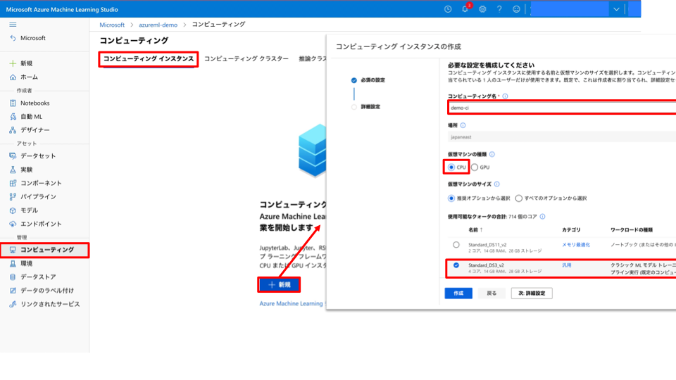
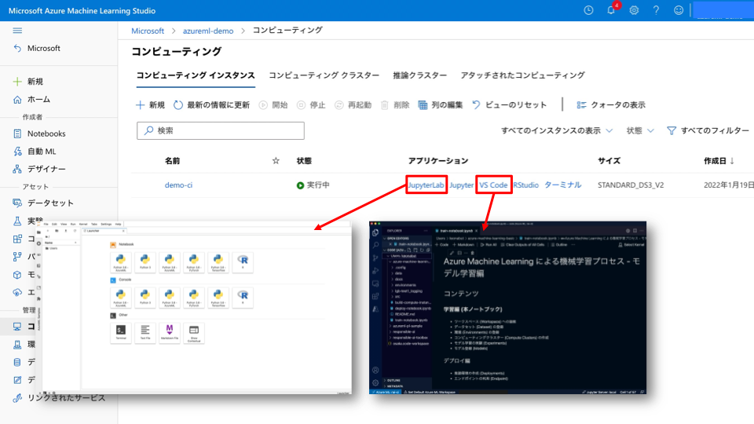
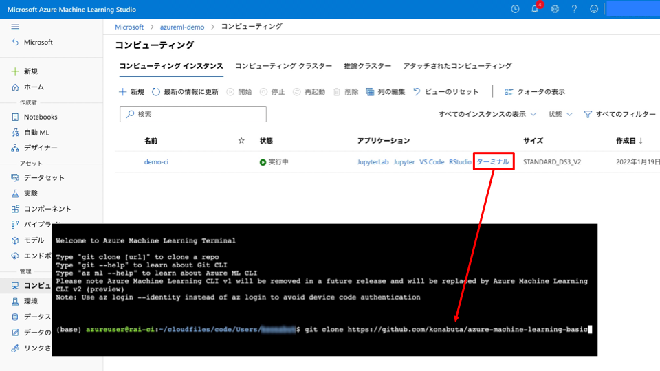

# Compute Instance の構築

Azure Machine Learning の Compute Instance を起動します。

1. Azure Machine Learning Workspace にログイン

2. コンピューティング (Compute) のコンピューティングインスタンス (Computing Instance) のタブから「新規」をクリック


3. 必須の構成に関する情報を設定
- コンピューティング名 : Azure の各リージョンでユニークな名前になるように設定
- 仮想マシンの種類 : CPU
- 仮想マシンのサイズ : クォータの余裕があればどの VM シリーズ選んでも OK (4個以上を推奨)


4. 設定の構成
- 必須の追加設定事項はありません。




5. 開発環境の起動
- JupyterLab や VSCode を利用します。



6. サンプルコードのクローン
- GitHub からコードをクローンします。

```bash
git clone https://github.com/konabuta/azure-machine-learning-basic
```



